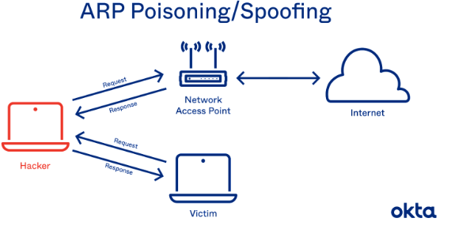

**1. Giao thức ARP**

Đây là một giao thức mạng dùng để tìm ra địa chỉ MAC của một thiết bị từ một IP nguồn.
VD: Thiết bị sẽ gửi 1 ARP request chưa IP của thiết bị nhận. Tất cả các mạng trong local network sẽ nhận đc gói tin nhưng chỉ có thiết bị khớp với IP trong gói ARP mới có thể phản hồi lại thông tin với thông điệp chứa địa chỉ MAC của nó.

**2. ARP Spoofing**

